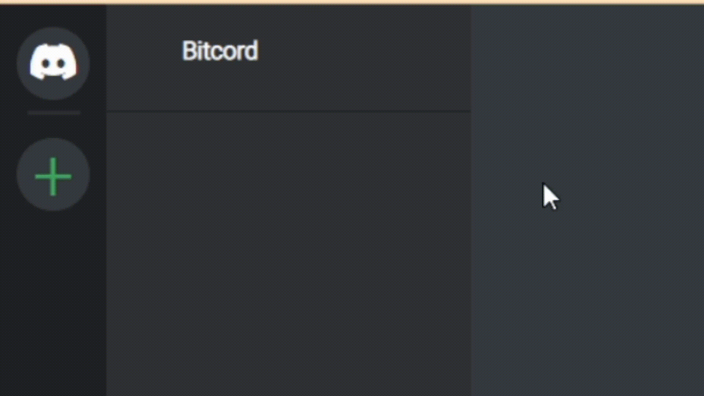

# bitcord
Bitcord - (Discord Simulation Framework) | Last Version: Beta_1.0.4

------------------------------- Başlarken -------------------------------

* Hikaye yazabilmek ve kılavuz desteği alabilmek için geliştirici modunu kullanmanız tavsiye edilir

(Sol üstteki Discord logosuna 3 defa tıklayınca aktifleşir)

---- Dosya Ekleme ----

* Karakter görsellerini "bitcord_assets/images/profile/" klasörüne ekleyin

(.webp uzantılı görsel kullanılması önerilir)

* Konuşma seslerini "bitcord_assets/sounds/speech_sounds/" klasörüne ekleyin

(sıkıştırılmış ses uzantıları önerilir, .mp3 kullanılabilir)

---- Kod ----

* Karakterlerinizi "bitcord_assets/js/bitcord_characters.js" dosyasına yazın

* Dilediğiniz oyun senaryosunu "bitcord_assets/js/bitcord_game.js" dosyasına yazın

(Senaryoların karışmaması için her senaryoya ayrı bir function açmanız önerilir)

------------------------------- Fonksiyonlar -------------------------------

1. mesaj_getir(karakter_isim_veya_id, fonksiyon_baslatma_zamani = 0, mesaj, bildirim_sesi = true, beraber_calisacak_fonksiyon = null);

2. arama_getir(karakter_isim_veya_id, fonksiyon_baslatma_zamani = 0, otomatik_kapatma_zamani = null, arama_kabul_edilirse, arama_reddedilirse, arama_kacirilirsa, konusma_bittiginde_kapatilirsa, konusma_bitmeden_kapatilirsa);

3. konusma_sesi_oynat(karakter_isim_veya_id, ses_dosyasi, fonksiyon_baslatma_zamani = 0, yeni_arama = true);

4. sahne_getir(sahne_adi, fonksiyon_baslatma_zamani = 0);

5. karakter_getir(karakter_isim_veya_id);

6. random_karakter_getir();

7. karakterin_özelligini_degistir(karakter_isim_veya_id, ozellik_adi, yeni_deger, fonksiyon_baslatma_zamani = 0, program_veya_manuel = false);

8. mesaj_gecmisini_sil(karakter_isim_veya_id = null, spesifik_veya_herkes, fonksiyon_baslatma_zamani = 0);

9. mesaj_getir_talebini_sil(karakter_isim_veya_id, fonksiyon_baslatma_zamani = 0);

10. mesaj_sablonu_olustur(karakter_isim_veya_id, mesaj);

11. buton_olustur(metin, tiklama_fonksiyonu, buton_style, buton_class, buton_id);

12. gorsel_olustur(gorsel_url, tiklama_fonksiyonu, gorsel_style, gorsel_class, gorsel_id);

13. konusma_sesi_bul(dosya_adi);

14. konusma_sesi_olustur(ses_dosyasi);

15. konusma_bitis_belirteci(karakter_isim_veya_id, fonksiyon_baslatma_zamani = 0);

16. aramayi_kapat(karakter_isim_veya_id, fonksiyon_baslatma_zamani = 0);

17. fake_bildirim(karakter_isim_veya_id, tip = "message", ses_oynat = null);

18. ekran_getir(karakter_isim_veya_id, tip = "message");

19. sayac_olustur(fonksiyon_baslatma_zamani = 0);

20. youtube_panel(link, panel_genislik = 760, panel_yukseklik = 415, id = null, kabul_buton_metni = null, kabul_edilirse = null, reddet_buton_metni = null, reddedilirse = null, iptal_buton_metni = null, iptal_edilirse = null);

