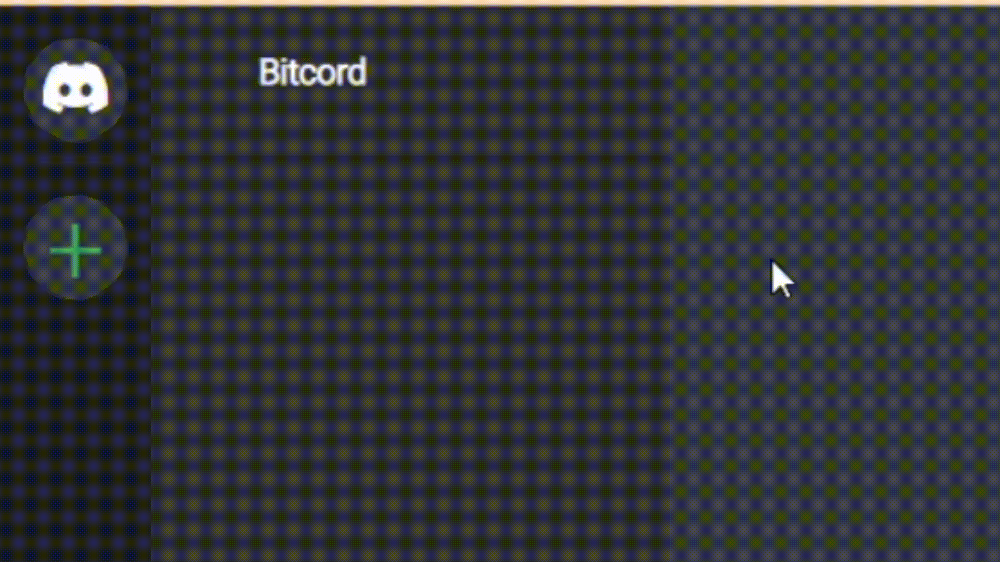

<div align="center">



# Bitcord.js

**Discord Simülasyon Framework'ü — Gerçekçi Discord deneyimleri ile interaktif hikayeler yaz.**

[](https://github.com/Moon-Chain/bitcord)
[](LICENSE)
[](https://developer.mozilla.org/en-US/docs/Web/JavaScript)
[](https://developer.mozilla.org/en-US/docs/Web/HTML)
[](https://www.linkedin.com/company/moonarctic)

</div>

---

## Nedir?

**Bitcord.js**, Discord arayüzünü simüle eden, sıfır kurulum gerektiren bir JavaScript framework'üdür. Karakter tanımla, sahne yaz, mesaj/arama/bildirim/ses efektleri gibi tüm Discord özelliklerini API çağrısı kadar kolay bir şekilde kullan — backend yok, sunucu yok, sadece bir HTML dosyası aç ve senaryonu yaz.

> Hikayelerin, oyunların, demolar veya sunum projeleri için idealdir.

---

## Özellikler

- **Gerçekçi Discord Arayüzü** — Pixel-perfect Discord tasarımı, karanlık tema
- **Mesaj Sistemi** — Zamanlanmış mesajlar, bildirim sesleri, HTML destekli mesaj içerikleri
- **Arama (Ses Araması)** — Gelen arama ekranı, kabul/red/kaçırma senaryoları
- **Konuşma Sesi** — Karakterlere ses dosyası ata, konuşma bitişi belirteci
- **Karakter Yönetimi** — Profil resmi, isim, özellik değiştirme, rastgele karakter seçimi
- **Sahne Sistemi** — Senaryoları fonksiyonlara böl, `sahne_getir()` ile tetikle
- **Interaktif Bileşenler** — Buton, görsel, YouTube paneli, emoji desteği
- **Bildirim Sistemi** — Fake bildirim pop-up'ları, toast mesajları
- **Geliştirici Modu** — Canlı kılavuz, terminal, bağlam menüsü, timer aracı
- **Sağ Tık Menüsü** — Karakterler, sahneler, kılavuz ve terminal'e hızlı erişim
- **F5 Koruması** — Yanlışlıkla sayfadan çıkışa karşı koruma
- **Mobil Uyumlu** — Responsive tasarım desteği

---

## Hızlı Başlangıç

### 1. Repoyu İndir

```bash
git clone https://github.com/Moon-Chain/bitcord.git
cd bitcord
```

### 2. `index.html` Dosyasını Aç

Herhangi bir kurulum gerekmez. Dosyayı tarayıcıda aç:

```
index.html → Sağ Tık → Tarayıcıda Aç
```

veya VS Code kullanıyorsan **Live Server** eklentisiyle aç.

### 3. Karakter Ekle

`bitcord_assets/js/bitcord_characters.js` dosyasına karakter tanımla:

```js
characters[13] = {
    id: 13,
    img_url: profile_file + "karakterim.webp",   // Profil resmi
    code_name: "karakterim",                      // Kodda kullanılan isim
    name: "Ali",
    surname: "Veli",
    display_name: "Ali V.",
    unread_message: 0,
    show: false,
    closeCallST: false
}
```

Profil resmini `bitcord_assets/images/profile/` klasörüne koy (`.webp` önerilir).

### 4. Senaryo Yaz

`bitcord_assets/js/bitcord_game.js` dosyasında senaryonu fonksiyon olarak yaz:

```js
function start_game() {
    sahne_getir("ilk_sahne");
}

function ilk_sahne() {
    mesaj_getir("karakterim", 0, "Merhaba! Bu bitcord ile yazılmış ilk mesajım.");
    mesaj_getir("karakterim", 2000, "2 saniye sonra bu mesaj geldi 👀");
    arama_getir("karakterim", 4000, 10000,
        function() {
            mesaj_getir("karakterim", 500, "Aramayı kabul ettin!");
        },
        function() {
            mesaj_getir("karakterim", 500, "Aramayı reddetttin :(");
        }
    );
}
```

---

## Dosya Yapısı

```
bitcord.js/
├── index.html                          ← Uygulamanın giriş noktası
├── bitcord_assets/
│   ├── js/
│   │   ├── bitcord_beta_1.0.5.js       ← Framework çekirdeği
│   │   ├── bitcord_characters.js       ← Karakter tanımları (sen yaz)
│   │   ├── bitcord_game.js             ← Oyun senaryoları (sen yaz)
│   │   └── bitcord_guide.js            ← Geliştirici kılavuzu
│   ├── css/
│   │   ├── bitcord_beta_1.0.5.min.css  ← Framework stilleri
│   │   └── glitch.min.css              ← Glitch efektleri
│   ├── images/
│   │   └── profile/                    ← Karakter profil resimleri (.webp)
│   └── sounds/
│       └── speech_sounds/              ← Konuşma ses dosyaları (.mp3)
└── assets/
    ├── css/fontawesome_4.7.0.min.css
    └── fonts/
```

---

## API Referansı

### Mesajlaşma

#### `mesaj_getir()`
Karakterden mesaj gönderir.

```js
mesaj_getir(
    karakter,           // string | Karakterin code_name'i
    süre,               // int    | Milisaniye cinsinden gecikme
    mesaj,              // string | HTML destekli mesaj içeriği
    bildirim_sesi,      // bool   | false = ses yok (varsayılan: true)
    beraber_çalışacak   // function | Mesajla aynı anda çalışacak fonksiyon
);

// Örnek
mesaj_getir("berkay", 1000, "Selam! Nasılsın?");
mesaj_getir("berkay", 2000, "Bak şu butona tıkla →" + buton_olustur("Tıkla", "alert('hey!')", null, "bbtn bbtn-blue"), false);
```

#### `mesaj_gecmisini_sil()`
Mesaj geçmişini temizler.

```js
mesaj_gecmisini_sil(karakter, süre);    // Belirli karakterin geçmişi
mesaj_gecmisini_sil(null, süre, true);  // Tüm geçmişi temizle
```

#### `mesaj_getir_talebini_sil()`
Henüz gelmemiş mesaj isteklerini iptal eder.

```js
mesaj_getir_talebini_sil("berkay", 0);
```

---

### Arama Sistemi

#### `arama_getir()`
Gelen arama ekranını açar.

```js
arama_getir(
    karakter,                   // string  | Arayan karakter
    başlangıç_süresi,           // int     | Ne zaman çalacak (ms)
    otomatik_kapatma,           // int     | Kaç ms sonra otomatik kapatılsın (null = manuel)
    arama_kabul_edilirse,       // function
    arama_reddedilirse,         // function
    arama_kaçırılırsa,          // function
    konuşma_bitince_kapatılırsa,// function
    konuşma_bitmeden_kapatılırsa// function
);

// Örnek
arama_getir("mee6", 1000, 15000,
    function() { mesaj_getir("mee6", 500, "Müziği başlatıyorum!"); },
    function() { mesaj_getir("mee6", 500, "Tamam, başka zaman..."); },
    null,
    function() { mesaj_getir("mee6", 500, "Konuşma bitti."); }
);
```

#### `aramayi_kapat()`
Aktif aramayı kapatır.

```js
aramayi_kapat("mee6", 5000);
```

---

### Ses Sistemi

#### `konusma_sesi_oynat()`
Karaktere ses dosyası oynatır.

```js
konusma_sesi_oynat(
    karakter,
    başlangıç_süresi,
    ses_dosyası,
    yeni_arama   // bool | true = yeni konuşma başlat (varsayılan: true)
);

// Örnek
konusma_sesi_oynat("mee6", 1000, konusma_sesi_bul("rising_spirits_music.mp3"));
```

#### `konusma_bitis_belirteci()`
Konuşmanın bittiğini işaretler (konuşma kabarcığı animasyonunu durdurur).

```js
konusma_bitis_belirteci("mee6", 16000);
```

#### `konusma_sesi_bul()`
Ses dosyasını `speech_sounds/` klasöründen bulur.

```js
var ses = konusma_sesi_bul("konusma.mp3");
```

---

### Karakter & Sahne

#### `karakter_getir()`
Karakterin nesnesini döndürür.

```js
var karakter = karakter_getir("berkay");
console.log(karakter.display_name); // "moonchain"
```

#### `random_karakter_getir()`
Rastgele bir karakter döndürür.

```js
var rastgele = random_karakter_getir();
mesaj_getir(rastgele.code_name, 0, "Ben rastgele seçildim!");
```

#### `karakterin_özelligini_degistir()`
Karakterin herhangi bir özelliğini çalışma zamanında değiştirir.

```js
karakterin_özelligini_degistir(
    karakter,
    süre,
    özellik_adı,    // "display_name" | "img_url" | "name" vb.
    yeni_değer,
    program_mu      // bool | false = manuel mod (varsayılan: false)
);

// Örnek
karakterin_özelligini_degistir("berkay", 2000, "display_name", "h4ck3r m00n");
karakterin_özelligini_degistir("berkay", 2000, "img_url", "hacked.webp");
```

#### `sahne_getir()`
Senaryo fonksiyonunu zamanlayıcıyla çalıştırır.

```js
sahne_getir("sahne_adi", başlangıç_süresi);

// Örnek
sahne_getir("boss_fight", 5000); // 5 saniye sonra sahneyi başlat
```

---

### Interaktif Bileşenler

#### `buton_olustur()`
Tıklanabilir buton HTML'i döndürür.

```js
buton_olustur(
    metin,
    tıklama_fonksiyonu,  // string | "fonksiyon_adi()"
    stil,
    class,
    id
);

// Örnek
var buton = buton_olustur("Kabul Et", "kabul_et()", null, "bbtn bbtn-blue");
mesaj_getir("bitcord", 0, "Anlaşmayı kabul ediyor musun? " + buton);
```

**Mevcut buton stilleri:** `bbtn-blue` `bbtn-red` `bbtn-green`

#### `gorsel_olustur()`
Tıklanabilir görsel HTML'i döndürür.

```js
var gorsel = gorsel_olustur("bitcord_assets/gifs/debug_mode.gif", "gorsel_tiklandi()", "width:400px;");
mesaj_getir("bitcord", 0, "Şuna bak: " + gorsel);
```

#### `emoji_olustur()`
Özel emoji ekler.

```js
mesaj_getir("berkay", 0, "Nasılsın? " + emoji_olustur("1.png"));
```

Emojiler `bitcord_assets/images/emogies/` klasöründen gelir.

---

### Bildirim & Ekran

#### `fake_bildirim()`
Discord bildirimi simüle eder.

```js
fake_bildirim(
    karakter,
    tip,       // "message" | "call" (varsayılan: "message")
    ses_oynat
);

// Örnek
fake_bildirim("berkay", "message");
```

#### `ekran_getir()`
Karakterin mesaj ekranını açar.

```js
ekran_getir("berkay", "message");
```

#### `youtube_panel()`
Mesaj ekranında YouTube videosu açar.

```js
youtube_panel(
    link,
    genişlik,            // varsayılan: 760
    yükseklik,           // varsayılan: 415
    id,
    kabul_buton_metni,
    kabul_edilirse,
    reddet_buton_metni,
    reddedilirse,
    iptal_buton_metni,
    iptal_edilirse
);

// Örnek
youtube_panel(
    "https://www.youtube.com/embed/NnPWfPNvy6A",
    760, 415, null,
    "Beğen", () => { alert("Beğenildi!"); },
    "Geç",  () => { alert("Geçildi."); }
);
```

---

### Yardımcı Araçlar

#### `sayac_olustur()`
Toast üzerinde milisaniye sayacı başlatır (senaryo zamanlama için).

```js
sayac_olustur(0); // Hemen başlat
```

#### `mesaj_sablonu_olustur()`
Sonradan gönderilmek üzere mesaj şablonu oluşturur.

```js
mesaj_sablonu_olustur("berkay", "Bu şablondan geldi");
```

---

## Geliştirici Modu

Geliştirici modu; canlı kılavuz, terminal ve bağlam menüsüne erişim sağlar.

### Aktifleştirme

**Yöntem 1 — URL parametresi:**
```
index.html?debugMode=true
```

**Yöntem 2 — Gizli kısayol:**
Sol üstteki Discord logosuna **3 kez tıkla.**


### Geliştirici Araçları

Geliştirici modu açıkken **sağ tıklayarak** bağlam menüsüne ulaş:

| Menü Öğesi | Açıklama |
|---|---|
| Karakterler | Tüm karakterleri listeler, ekrana getirir |
| Sahneler | Tanımlı sahneleri listeler |
| Bitcord Kılavuz | İnteraktif API kılavuzu |
| Terminal | Anlık JS kodu çalıştır |

---

## Örnek Senaryolar

<details>
<summary><strong>Hacker Senaryosu</strong></summary>

```js
function hacker_senaryosu() {
    mesaj_getir("hacker_team", 0, "Bağlantı kuruluyor...");
    mesaj_getir("hacker_team", 2000, "Sisteme erişim sağlandı. " + emoji_olustur("4.png"));
    karakterin_özelligini_degistir("user", 3000, "display_name", "h4ck3d");
    karakterin_özelligini_degistir("user", 3000, "img_url", "hacked.webp");
    mesaj_getir("hacker_team", 4000, "Seni bulduk. " +
        buton_olustur("Teslim Ol", "teslim_ol()", null, "bbtn bbtn-red") + " " +
        buton_olustur("Kaç", "kac()", null, "bbtn bbtn-blue")
    );
}
```

</details>

<details>
<summary><strong>Müzik Bot Araması</strong></summary>

```js
function muzik_bot_senaryosu() {
    arama_getir("mee6", 1000, 20000,
        function() {
            mesaj_getir("mee6", 500, "Müzik başlıyor!");
            konusma_sesi_oynat("mee6", 1000, konusma_sesi_bul("rising_spirits_music.mp3"));
            konusma_bitis_belirteci("mee6", 19000);
        },
        function() {
            mesaj_getir("mee6", 500, "Tamam, başka zaman! " + emoji_olustur("2.png"));
        }
    );
}
```

</details>

---

## Teknolojiler

| Kütüphane | Amaç |
|---|---|
| [jQuery 3.6](https://jquery.com/) | DOM manipülasyonu |
| [Toastr.js](https://codeseven.github.io/toastr/) | Toast bildirimleri |
| [SweetAlert2](https://sweetalert2.github.io/) | Modal diyaloglar |
| [Boxicons](https://boxicons.com/) | İkon seti |
| [Font Awesome 4.7](https://fontawesome.com/) | İkon seti |

---

## Katkı

Pull request'ler açıktır. Büyük değişiklikler için önce bir issue açarak ne değiştirmek istediğini belirt.

1. Repoyu fork et
2. Feature branch oluştur (`git checkout -b feature/harika-ozellik`)
3. Değişiklikleri commit et (`git commit -m 'feat: harika özellik eklendi'`)
4. Branch'i push et (`git push origin feature/harika-ozellik`)
5. Pull Request aç

---

## Lisans

[MIT](LICENSE) — © 2022 [moonchain](https://github.com/Moon-Chain) / [MoonArctic Games](https://www.linkedin.com/company/moonarctic)

---

<div align="center">

**[moonchain](https://github.com/Moon-Chain)** tarafından yapıldı · **[MoonArctic Games](https://www.linkedin.com/company/moonarctic)**

</div>
